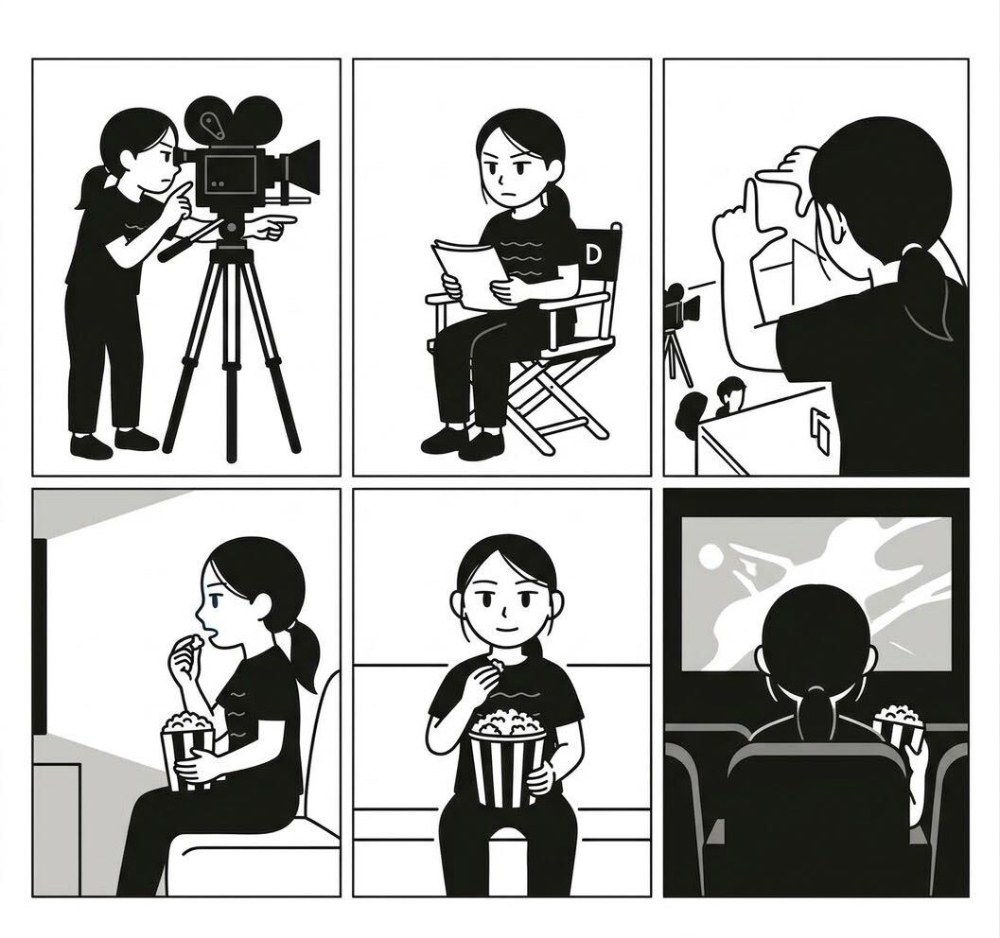
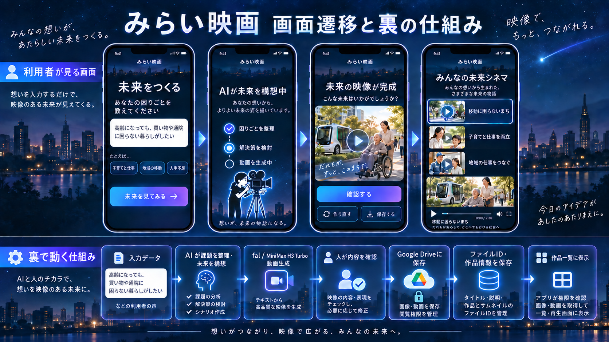

# みらい映画（mirai-cinema）

**困りごとや想いを日本語で入力すると、AIがよりよい未来の姿を映像にするツール**

## このリポジトリについて

チームみらい バイブコーディング会 **Dチーム「未来をイメージできる画像・動画生成」** の開発リポジトリです。

まだ何もできていません。ここから **これから一緒に作ります**。
プログラミングが初めての人も大歓迎です。わからないことは遠慮なく聞いてください。

## コンセプト

「撮る人」が想いを入力し、「観る人」が未来の姿を映像で受け取る。そんなツールを目指します。



## 利用者の流れ



利用者から見た流れは次の通りです。

- 困りごとや想いを日本語で入力する
- AI が未来の姿を構想する
- 映像が完成し、内容を確認する
- 「みんなの未来シネマ」の一覧に並ぶ

## 裏の仕組み（構想）

画面の裏側では、次のような処理を想定しています。

- AI が課題を整理する
- AI が動画を生成する
- 人が内容を確認する
- Google Drive に動画を保存する
- 作品情報を保存する
- 一覧に表示する

**使う技術やサービスの詳細は、これからみんなで決めます。**

## はじめかた（clone の手順）

### 1. Git が入っているか確認する

ターミナル（Windows は PowerShell、Mac は「ターミナル」）を開いて、次を実行します。

```
git --version
```

バージョン番号が表示されれば OK です。表示されない場合は https://git-scm.com/downloads からインストールしてください。

### 2. リポジトリを clone する

作業したいフォルダに移動してから、次をそのまま貼り付けて実行します。

```
git clone https://github.com/itc-ri/mirai-cinema.git
```

### 3. フォルダに入る

```
cd mirai-cinema
```

これで準備完了です。

## 開発ルール（最小限）

- **main ブランチには直接 push しない**
- **作業はブランチを切って行い、Pull Request（PR）を出す**

ブランチを切る例：

```
git switch -c feature/your-topic
```

`your-topic` は作業内容がわかる名前にしてください（例：`feature/input-form`）。

## ライセンス

[MIT License](LICENSE)
